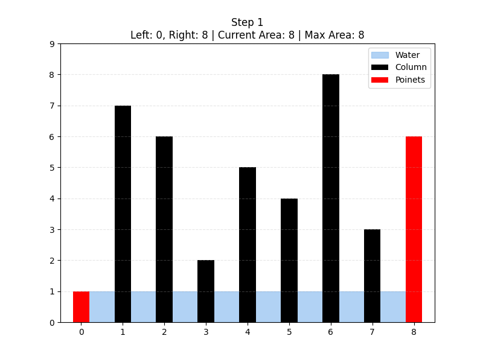

## Two Pointers

### Description

The core idea lies in saving time and space during calculation by avoiding allocating memory 
for information used only once. More importantly, it allows us to save time by avoiding brute 
force measures, such as computing all possible pairs.

This concept is often implemented by declaring two pointers (where the name of the idea comes from)
that index the needed positions (usually the left and right edges). As the code runs, the pointers 
move to accomplish the task.

A great instance of the two pointers approach is the LeetCode 11 task: **"Container With Most Water."**

---

### Approaches

The first thought might be to take all possible pairs in `O(N^2)` and find the maximum among them.

However, there exists a faster **two pointers** approach. Here, we set our pointers to the left and 
right edges of the array and calculate the volume of the container. Then, we move the pointer of the 
lower wall towards the middle to try and find a taller wall.

---

### Complexity

- **Time Complexity:** `O(N)` — each pointer moves at most N times.
- **Space Complexity:** `O(1)` — no additional memory is used.

---

### Pros and Cons

**Pros (Advantages):**
- Avoids brute-force solutions.
- Very memory efficient.
- Simple and elegant logic once understood.

**Cons (Disadvantages):**
- Requires careful pointer movement logic.
- Not always intuitive at first glance.
- Not applicable to every problem.

---

### Alternatives

- **Brute Force**
  - Tries all possible pairs.
  - Time complexity `O(N^2)`.

- **Prefix-based approaches**
  - Sometimes applicable, but usually require extra memory.

---

### When to Use

**Key Indicators:**
- You are working with sorted data or linear structures.
- You need to compare elements from both ends.
- The task involves pairs, ranges, or shrinking windows.
- You want an `O(N)` solution instead of `O(N^2)`.

---

### Related LeetCode Problems

### 11. Container With Most Water

```
def maxArea(height: list[int]) -> int:
    max_capacity = 0
    l, r = 0, len(height) - 1
    while l < r:
        max_capacity = max((r-l) * min(height[l], height[r]), max_capacity)
        if height[l] < height[r]:
            l += 1
        else:
            r -= 1
    return max_capacity
```
___
#### 42. Trapping Rain Water
```
def trap(self, height: List[int]) -> int:
        if not height:
            return 0
        left, right = 0, len(height) - 1
        
        left_max, right_max = 0, 0
        water = 0
        while left < right:
            if height[left] < height[right]:
                if height[left] >= left_max:
                    left_max = height[left] 
                else:
                    water += left_max - height[left] 
                left += 1
            else:
                if height[right] >= right_max:
                    right_max = height[right]
                else:
                    water += right_max - height[right]
                right -= 1
                
        return water
```

### 9. Palindrome Number
```
def isPalindrome(x: int) -> bool:
    x = str(x)
    l, r = 0, len(x) - 1
    while l < r:
        if x[l] != x[r]:
            return False
        l += 1
        r -= 1
    return True
```


### 28. Find the Index of the First Occurrence in a String
```
def strStr(haystack: str, needle: str) -> int:

    if needle == "":
        return 0
    if len(needle) > len(haystack):
        return -1
    i = 0
    j = 0
    start = 0
    while i < len(haystack):
        if haystack[i] == needle[j]:
            j += 1
            if j == len(needle):
                return i - j + 1
        else:
            start += 1
            i = start - 1
            j = 0
        i += 1
    return -1
```

### 88. Merge Sorted Array
```
def merge(nums1: list[int], m: int, nums2: list[int], n: int) -> None:
    i = j = 0
    while j < n:
        if i >= m + j or nums2[j] <= nums1[i]:
            nums1.insert(i, nums2[j])
            j += 1
            nums1.pop()
        i += 1
```

### 125. Valid Palindrome
```
def isPalindrome(s: str) -> bool:
    s = "".join([i.lower() for i in s if i.isalnum()])
    l = 0
    r = len(s) - 1
    while l < r:
        if s[l] != s[r]:
            return False
        l += 1
        r -= 1
    return True
```

### 202. Happy Number
```
def isHappy(n: int) -> bool:
    def next_num(x):
        return sum([int(i) ** 2 for i in str(x)])
    slow = n
    fast = next_num(n)
    while fast != 1 and slow != fast:
        slow = next_num(slow)
        fast = next_num(next_num(fast))
    return fast == 1
```