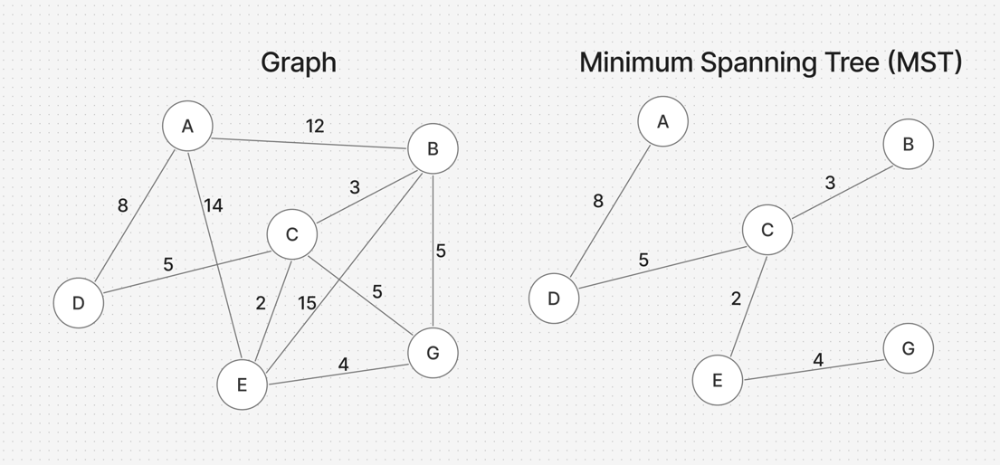

### Description
Kruskal's algorithms is one of the ways to day searching the minimum spanning tree from the given graph.
This tree should follow next rules:
- Has the same vertices to the graph
- Doesn't have loops
- Connected – exists path between any two vertices
- Tree should have the minimum sum of weights

Here is example of MST from given graph:

___
### Approaches
The Kruskal's Algorithm uses Disjoint Set data structure. But we need to midify the `parent` and the rank
variable to work with any type of data, because can be represented as a string or int number.
```python 
self.parent = {v: v for v in vertices}
self.rank = {v: 0 for v in vertices}
```

Firstly, we find all the edges from the graph and sort them by their weight.
Then we creat a list for edges that MST would contain. We make union for vertices of the edge if
they have different representor. In the case when representor is the same for both vertices we skip 
this edge. We continue until rank for all vertices except one will be 1 which means that all the nodes
are connected.

___
### Complexity
#### Time complexity
- $O(E log E)$ – because of need to sort the edges 
#### Space complexity : $O(E + V)$ where $E$ is count of edges and $V$ is count of vertices in the given graph
___
### Pros and Cons

#### Pros

- Easy to implement
- Garantie MST
- Works without starting vertex
- Easy to modify for any problem

#### Cons

- Doesn't work for oreinted graphs
- For full graph the complexity will be $E^2$
- Require disjoint set data structure


#### Alternatives

Prim's Algorithm – Similar to Dijkstra's algorithm, Prim's grows the Minimum Spanning Tree (MST) from a specific root vertex.


#### When to Use

You should use Kruskal's Algorithm when:
1. The graph is sparse (the number of edges is small compared to the number of vertices squared).
2. The edges are already sorted; this allows you to skip the most time-consuming step (O(E log E), making the algorithm extremely fast.
3. You need a quick and simple implementation
4. Your data is stored as an edge list.

On the other hand, you should use Prim's Algorithm if the graph is dense, because Prim's complexity relies more on the number of vertices rather than the number of edges.
___
### Related LeetCode Problems

1489. Find Critical and Pseudo-Critical Edges in Minimum Spanning Tree
1584. Min Cost to Connect All Points
3600. Maximize Spanning Tree Stability with Upgrades