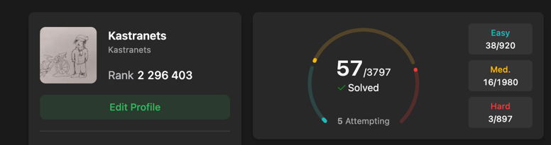
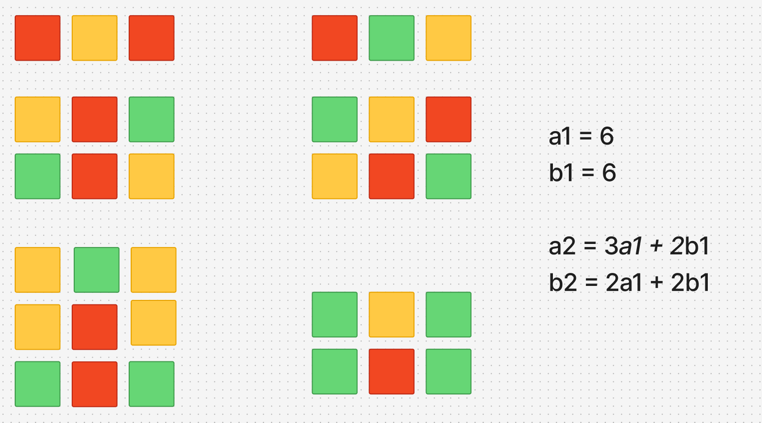

# Day 11
___
- [Maksym’s Notes](#Maksym)
- [Ihor’s Notes](#Ihor)
___


# Maksym 

# Day 11

This was the eleventh day of the challenge.
Saturday.

---

## Bellman-Ford

Today's topic was widely knew **Belman-Ford**.

### My Thoughts
Empty


### Algorithm
**Bellman-Ford** algorithm allows us to find min distance from single node to every other.
Special about this algorythm is that it can work with graphs ,  which contain negative-weight edges.
*NOTE* There must not be cycles of negative weight.
Idea is simple , we brute force throught list of edges at most *V-1* times.
On every step we check all edges, updating minimal possible distance to vertices which are connected by this edge.
Relevant question is why at most *V-1* ?
Reason is simple , it is gratest possible length of minimal path.
If path is longer => there exist cycle => length is not minimal.Therefore , we can optimize it.

**Efficency**
1. Time Complexity : **O(V*E)** , due to going through vertices and find min using min-heap.
2. Space Complexity : **O(V)** , **O(V)** size array for vertices


That's all! ))

## LeetCode


I've completed daily task **1411. Number of Ways to Paint N × 3 Grid**

Regarding today's algorythm , I resubmitted **743. Network Delay Time** and completed
**1334. Find the City With the Smallest Number of Neighbors at a Threshold Distance**


That's all for today)

----

## LetCode problems

#### My implementation of Bellman-Ford
```python
def bellman_ford(graph : list , n : int , v ):
    dist = [float("inf")]*n
    prev = [-1] * n

    def update(dist : list ,prev : list , el):
        par , to , w = el[0] , el[1] ,el[2]
        tmp = dist[to]

        if dist[par] == float("inf"):
            return

        dist[to] = min(dist[to] , dist[par] + w )

        if tmp != dist[to]:
            prev[to] = par


    dist[v] = 0
    for i in range(n-1):
        for el in graph:
            update(dist , prev , el)

    return dist , prev

```

#### 1334. Find the City With the Smallest Number of Neighbors at a Threshold Distance
```python

class Solution:
    def findTheCity(self, n: int, edges: List[List[int]], distanceThreshold: int) -> int:
        directed_edges = []
        for u, v, w in edges:
            directed_edges.append([u, v, w])
            directed_edges.append([v, u, w])

        def bellman_ford(graph: list, n: int, v: int):
            dist = [float("inf")] * n
            prev = [-1] * n

            def update(dist: list, prev: list, el: list):
                par, to, w = el[0], el[1], el[2]

                if dist[par] == float("inf"):
                    return

                tmp = dist[to]
                dist[to] = min(dist[to], dist[par] + w)

                if tmp != dist[to]:
                    prev[to] = par

            dist[v] = 0

            for i in range(n - 1):
                changed = False
                for el in graph:

                    before = dist[el[1]]

                    update(dist, prev, el)

                    if dist[el[1]] != before:
                        changed = True
                if not changed:
                    break

            return dist, prev

        min_reachable = float('inf')
        best_city = -1

        for i in range(n):
            dists, _ = bellman_ford(directed_edges, n, i)

            count = 0
            for node_idx, d in enumerate(dists):
                if node_idx != i and d <= distanceThreshold:
                    count += 1

            if count <= min_reachable:
                min_reachable = count
                best_city = i

        return best_city

```

___
# Ihor

## Overall
So, this is the eleventh day of our challenge, and it’s going all right. I have a lot of free time, 
which I try to use to relax a little, but I have a big problem distinguishing between 
the learning process and relaxing. I tend to combine them, and that becomes the main reason why
I feel tired despite doing less than I expected. I also realized that I haven’t received any reward
in this challenge so far, and the prize of half-off the challenge – registration for **EURO 2026** 
– doesn’t satisfy me at all.

I’m not even sure if I really want to compete in that competition. On top of that, 
I’ve started overthinking it, but I will still do it because it’s just the inner voice telling me
that it’s not rational to spend $100 on it. I believe I will have so much fun discussing results 
with other cubers. Maybe I would feel out of place being there not as a competitor, 
with the only reason being my reluctance to pay the registration fee.

The main reward – the **PowerMeter** I have been dreaming about for almost 6 years – 
is still a significant reason to continue this challenge. I hope I will succeed, and
I can’t wait for the moment I press the confirm button on my bank account and, just 2 weeks later,
receive that long-awaited package.

Maybe I need to give myself smaller rewards, especially during my Prague trip. If I manage to stick
to the challenge while I’m there, I’ll treat myself to something special from a local stores.

___

## FeedBacks

### Mrs. Yulia
Yesterday I asked Mrs. Yulya if I could attend on her classes as a listener without obligations. Also I 
told her about our challenge and I got some inspiration to keep going because now I feel myself more
responsible about her opinion. She said that it's a great challenge and said tha we are doing great.

### Mrs. Tetiana
Almost weak ago I felt that we would stuck soon, so I decided to ask her about help in choosing 
algorithms and shared our GitHub repository. She also said that we are doing great and recomended me
to ask Roman Leshchuk about help because he is good at algorithms.

### Roman Leshchuk
I wrote him a regular message where explained what we are doing, what we already learned and what we
are interested in. He was answering about 1 hour and sent me a long message with suggestions what we
can learn. I feel graitful to him, for his advices.

### Oles 
Today I texted him in telegram and asked to check our `GitHub` repository and my `LinkedIn` account.
He aswered immidiatly and said that will do it tommorow. So, I am waiting with amaze

___

## LeetCode
. 
Today I salved my first problem using Dynamic Programming.

>### 1411. Number of Ways to Paint N × 3 Grid
>You have a grid of size n x 3 and you want to paint each cell of the grid with exactly one of the three colors: Red, Yellow, or Green while making sure that no two adjacent cells have the same color (i.e., no two cells that share vertical or horizontal sides have the same color).
<br>Given n the number of rows of the grid, return the number of ways you can paint this grid. As the answer may grow large, the answer must be computed modulo $10^9 + 7$.


It was dayle problem and I used combinatory.
The solution was quite simple but I spent a lot time to understand the logic for formula. I used figma 
to draw possible combinations.


Then I learned Bellman-Ford algorithm and solved some problems on LeetCode. I fell much more confident
in this algorithm tha Dijkstra's. So, I am going to retake Heap data structure and implement Dijkstra 
again tomorrow.

Than I solved some pandas problems. I learned methods `sort_values`, `dt` for datatime type and `reset_index`


